# Assignment Introduction

A Software Design Document (SDD) describes the design and architecture of your software. This type of documentation often follows the 4+1 design perspectives approach. The 4 perspectives (or views) of software are

1. _Logical View_ – major components, their attributes and operations. This view also includes relationships between components and their interactions. When doing OO design, class diagrams and sequence diagrams are often used to express the logical view.
2. _Process View_ – the threads of control and processes used to execute the operations identified in the logical view.
3. _Development View_ – how system modules map to development organization.
4. _Physical View_ – shows the system hardware and how software components are distributed across the processors in the system.

The +1 perspective is the

> Use Case View – the use case view is used to both motivate and validate design activity. At the start of design the requirements define the functional objectives for the design. Use cases are also used to validate suggested designs. It should be possible to walk through a use case scenario and follow the interaction between high-level components. The components should have all the necessary behavior to conceptually execute a use case.

# Assignment Requirements

For your project, you are only required to document the **_Logical View_** of your software, You must use markdown (.md file) to do this.

Your documentation should have three sections: Overview, Design, Examples, and Status. Requirements for each section are described below.

# Overview of Required Sections

## Overview

This Financial tracker is a web based application built with React and Vite that allows users to manage their personal finances. Users can create an account, log in securely, track their income and expenses, manage their monthly salary, and learn basic financial literacy through educational modules. Data is persisted using a backend API (Node.js/Express) with a MySQL database. The app focuses on user-friendliness, modular design, and visual clarity.

## Design

The app is designed as follows...

APP
Header
Router
HomePage
AccountPage
SavingsPage
SpendingsPage
SettingsPage
LearnPage
SavingTopic
InvestingTopic
BugdetingTopic
AuthPopup (Login/Signup)
CurrentUser
Footer

Some of the key modules are as follows...

App.jsx

1. root component
2. Initializes routes
3. contains global layout and navigation
4. hosts login/singup state

UserContent.jsx

1. React context provider
2. shares current user state globally

AuthPopup.jsx

1. Manages login and singup forms
2. sends credentials to backend via fetch

SavingsPage.jsx

1. Allows user to input and save monthly salary
2. interacts with /get-salary and /set-salary endpoints

SpendingsPage.jsx

1. Lets users log and view categorized expenses
2. fetches transaction list from backend

LearnPage.jsx

1. Contains three educational modules: Saving, budgeting, investing.
2. User nested routes for topic content

AccountPage.jsx

1. Displays Current user and logout option

### Diagrams you might want to use

- **Box and Line Diagram**: for depicting software components and how they are connected
- **UML Class Diagram**: for depicting code structure
- **UML State Diagram**: for depicting states of your software
- **ERD Diagram**: for depicting the tables in a database

You can use any other diagram that you find helpful for describing your software. You are expected to use diagrams and clearly describe what is depicted in your diagrams.

This section will contain the most content. The documentation should fully document the latest version of your software. If you make changes to your software, you should update this document to reflect those changes.

## Examples

Give screenshots of your running project and briefly describe what is in the screenshots.

### Home Page (Light)

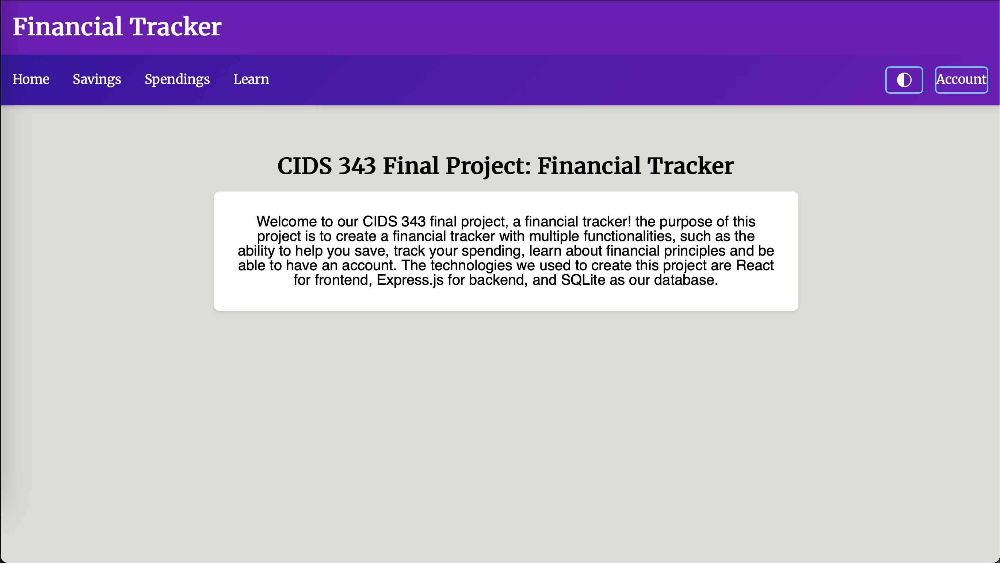

### Home Page (Dark)

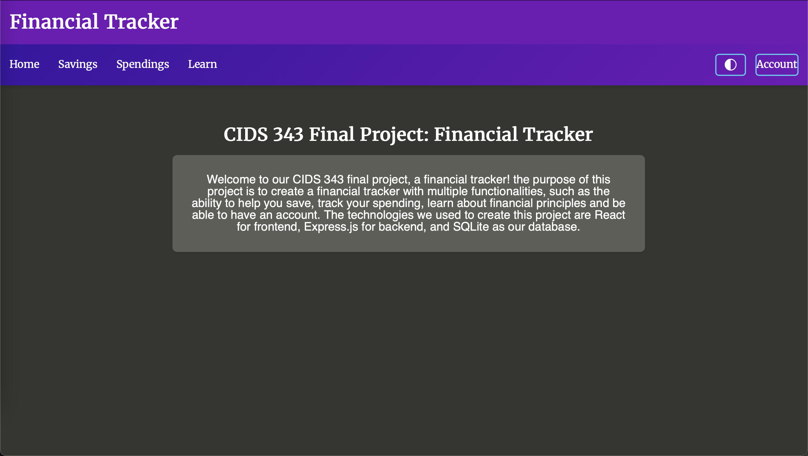

### Login Popup

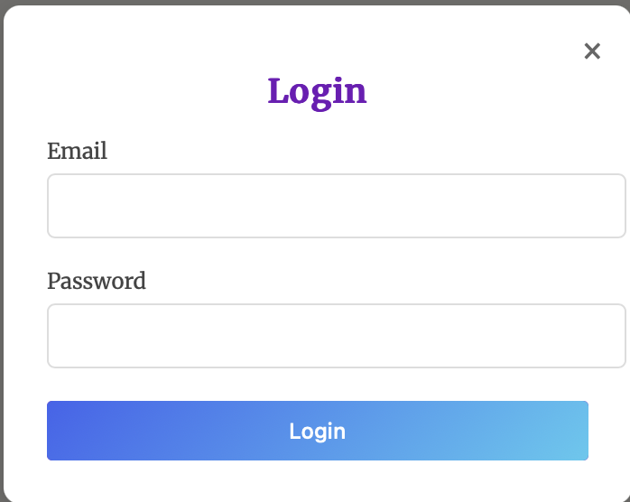

### Sign Up Popup

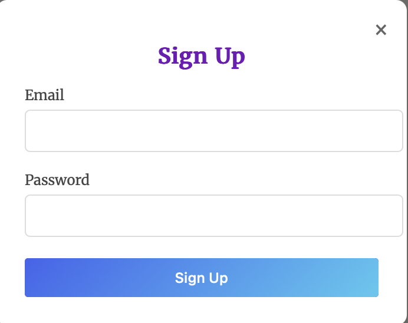

### Savings Page

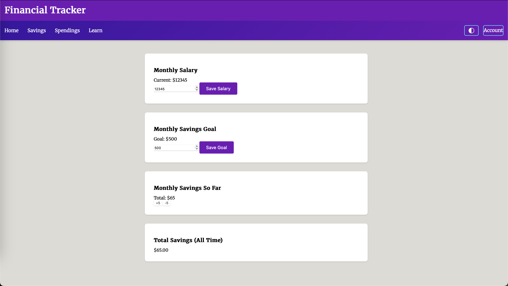

### Spendings Page 1

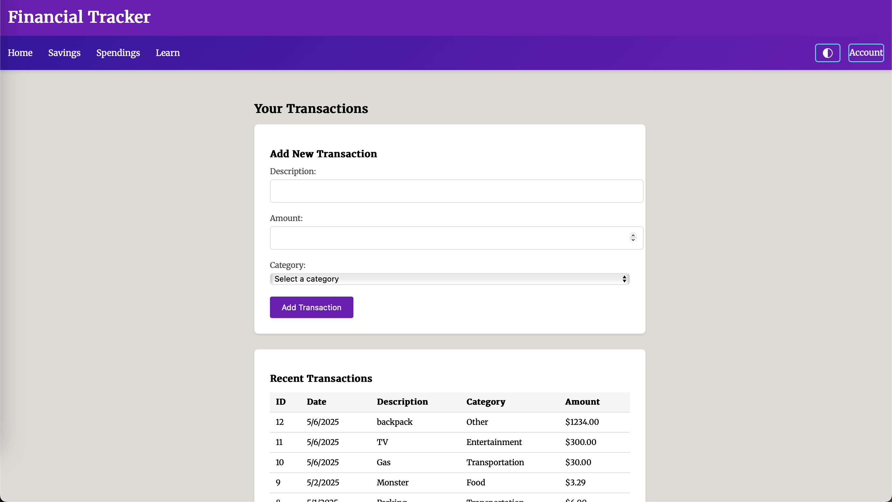

### Spendings Page 2

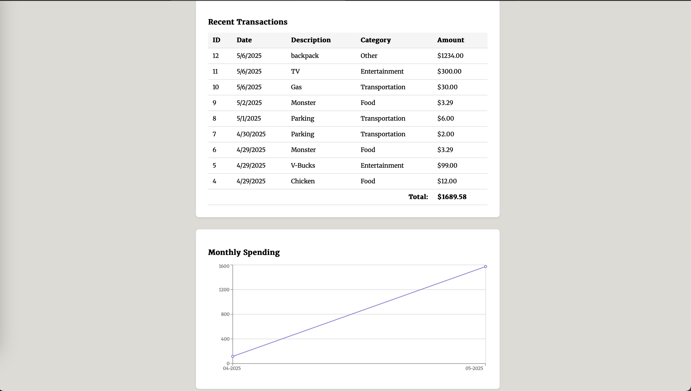

### Learn Page 1

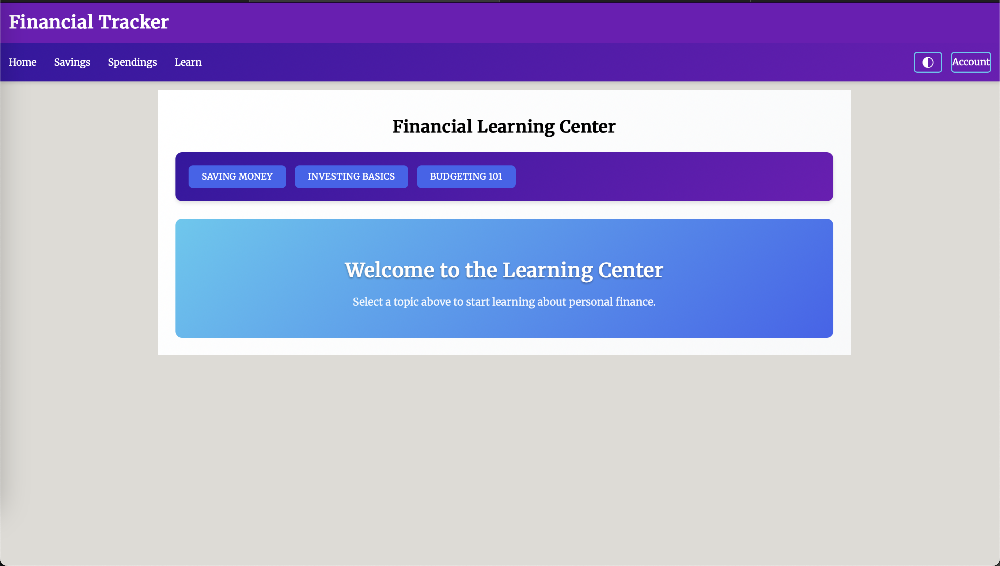

### Learn Page 2

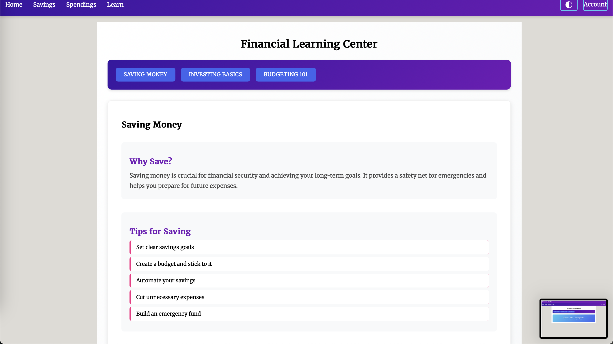

### Account Page

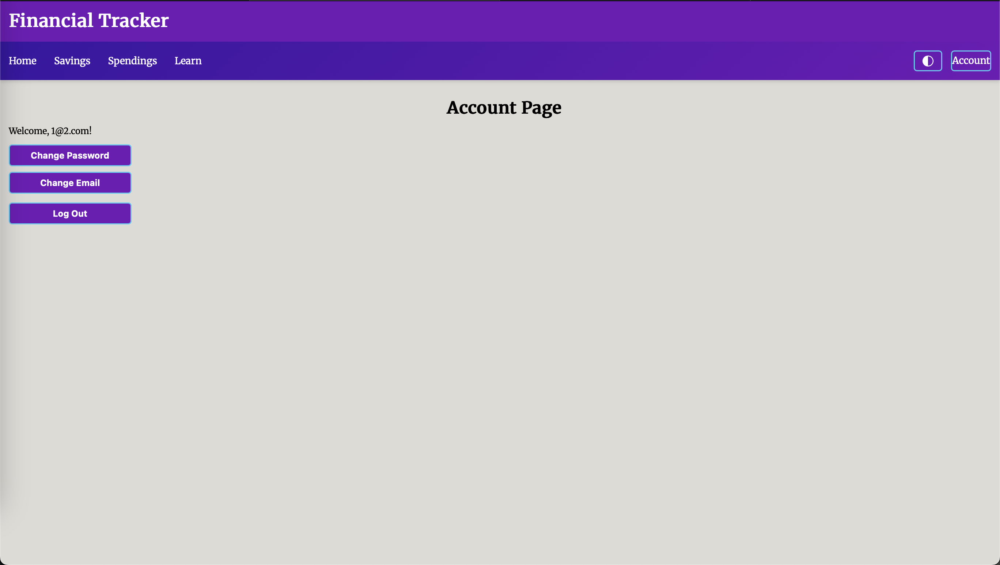

### Change Email

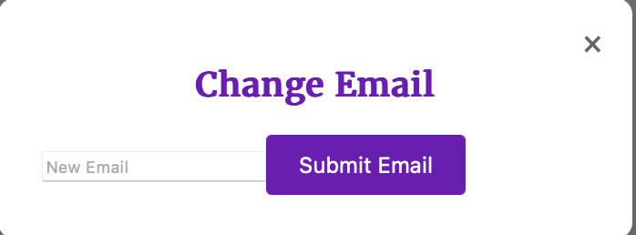

### Change Password

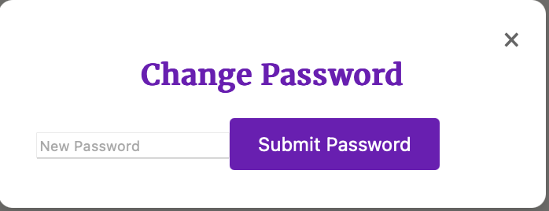

## Status

CURRENT FEATURES

1. Create account, log in, log out
2. View and update salary
3. Log categorized spending
4. Access educational content
5. Responsize styling and dark mode support

PLANNED FEATURES

1. Visual dashboards with pie or bar charts
2. Recurring transaction scheduling
3. Income vs Spending trends
4. Backend deployment to cloud (Render/Heroku)
