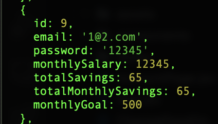

## Overview

This Financial tracker is a web based application built with React and Vite that allows users to manage their personal finances. Users can create an account, log in securely, track their income and expenses, manage their monthly salary, and learn basic financial literacy through educational modules. Data is persisted using a backend API (Node.js/Express) with a MySQL database. The app focuses on user-friendliness, modular design, and visual clarity. It serves as both a tool of utility in its financial tracking abilities, and an oppurtunity to learn more about financial literacy and how to properly save and spend money, which in turn makes the utility function of the app even more useful. It is an app that can be applied by people of all walks of life, at any time, and for any kind of financial tracking you can imagine.

## Design

The app is designed as follows...

    APP

      Header

      Router

        HomePage

        AccountPage

        SavingsPage

        SpendingsPage

        SettingsPage

        LearnPage

          SavingTopic

          InvestingTopic

          BugdetingTopic

    AuthPopup (Login/Signup)

    CurrentUser

    Footer

Some of the key modules are as follows...

### App.jsx

1. Root component
2. Initializes routes
3. Contains global layout and navigation
4. Hosts login/singup state

### UserContent.jsx

1. React context provider
2. Shares current user state globally

### AuthPopup.jsx

1. Manages login and singup forms
2. Sends credentials to backend via fetch

### SavingsPage.jsx

1. Allows user to input and save monthly salary
2. Interacts with /get-salary and /set-salary endpoints

### SpendingsPage.jsx

1. Lets users log and view categorized expenses
2. Fetches transaction list from backend

### LearnPage.jsx

1. Contains three educational modules: Saving, budgeting, investing
2. User nested routes for topic content

### AccountPage.jsx

1. Displays Current user and logout option
2. Has buttons to change email and password

### ERD Diagram

### Relational Schema

### State Diagram

### Home Page (Light)

### Home Page (Dark)

### Login Popup

### Sign Up Popup

### Savings Page

### Spendings Page 1

### Spendings Page 2

### Learn Page 1

### Learn Page 2

### Account Page

### Change Email

### Change Password

### User Table

### Transaction Table

## Status

CURRENT FEATURES

1. Create account, log in, log out
2. View and update salary
3. Log categorized spending
4. Access educational content
5. Responsize styling and dark mode support

PLANNED FEATURES

1. Visual dashboards with pie or bar charts
2. Recurring transaction scheduling
3. Income vs Spending trends
4. Backend deployment to cloud (Render/Heroku)
